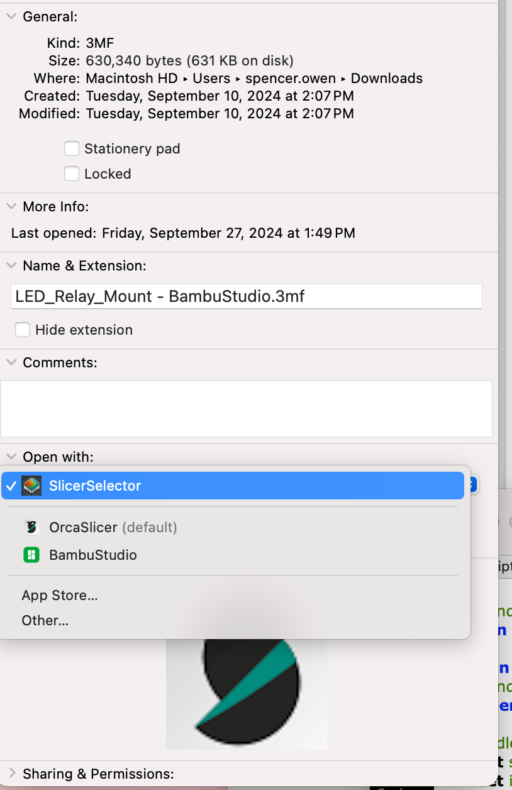

#  🍰 Slicer Selector

Choose which 3d Printer Slicer software to use on-the-fly

## 💿 Installation

`make && make install`

Optionally right click a .stl and .3mf file and chose 'SlicerSelector' as the default application

## How it works

SlicerSelector looks at `/Applications` directory for installed Slicers. It presents them as a list and allows passing in options

## 💻 Development

1. Modify [SlicerSelector.app/Contents/Resources/Scripts/main.scpt](./SlicerSelector.app/Contents/Resources/Scripts/main.scpt)

## 🥅 Goals

- Rewrite this as a native OSX Application and include in appstore or homebrew
- Windows support
- Support multiple instances of Slicers and allow choosing which process to import into

## 🐛 Known Bugs

- Prusa Slicer will not be detected if it is installed to `/Applications/Original\ Prusa\ Drivers/PrusaSlicer.app`. Move the slicer to `/Applications`

## Notes

Inspiration for this application comes from the popular browser switcher [Velja](https://sindresorhus.com/velja)
